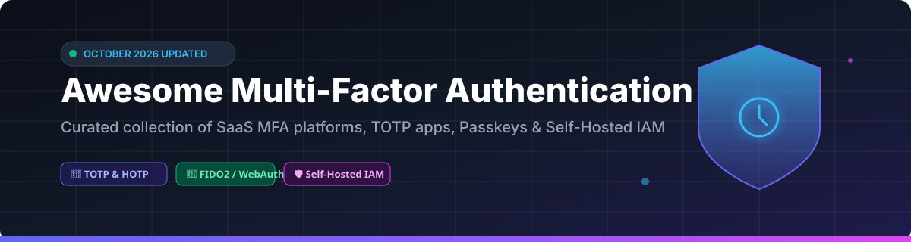

  

# 🔐 Awesome Multi-Factor Authentication (MFA) &amp; 2FA Ecosystem 🛡️

  
  
  
  
  
  

> 🚀 **Curated List of Commercial SaaS MFA Platforms & Open-Source GitHub Projects**
> 
> *Focusing on TOTP Apps, Hardware Security Keys (FIDO2/WebAuthn), Passkeys, Self-Hosted Identity Providers (IAM/IdP), and Enterprise 2FA Infrastructure.*
>
> 📅 **Last updated: October 2026**

---

## 💡 Overview & Ecosystem Insights 🧠

Multi-Factor Authentication (MFA) provides a crucial layer of defense beyond standard passwords by incorporating Time-based One-Time Passwords (TOTP), HMAC-based One-Time Passwords (HOTP), hardware security keys (FIDO2/WebAuthn), push notifications, and biometric verification.

This repository tracks **commercial SaaS MFA providers** alongside **production-grade open-source authentication tools**. Whether you are looking for a zero-knowledge local 2FA app (like Aegis or Ente Auth) or an enterprise identity broker (like Keycloak or Authentik), this guide highlights leading solutions.

---

## 📖 Table of Contents 🗂️

- [☁️ Commercial SaaS / Hosted MFA Platforms](#-commercial-saas--hosted-mfa-platforms)
- [🔓 Open-Source GitHub Projects](#-open-source-github-projects)
- [🤝 How to Contribute](#-how-to-contribute)
- [💖 Support & Sponsorship](#-support--sponsorship)
- [⚠️ Disclaimer & Security Caveats](#%EF%B8%8F-disclaimer--security-caveats)
- [📈 Star History](#-star-history)

---

## ☁️ Commercial SaaS / Hosted MFA Platforms

> 📊 **Market Size & Structure Analysis**: The global Multi-Factor Authentication (MFA) market is estimated at **~$15 Billion in 2026**, projected to reach **~$35 Billion by 2032**. The market is **moderately fragmented**: consumer adoption is concentrated around bundled ecosystem apps (**Microsoft Authenticator**, **Google Authenticator**), while enterprise deployments are divided among identity platform leaders (**Okta**, **Cisco Duo**, **RSA SecurID**, and **Ping Identity**).

*(Sorted by Company Size / Valuation descending)* ⬇️

| Platform | Description | Pricing (Starting Tier) | Free Tier Limits | Company Size / Revenue 📈 |
|:---|:---|:---|:---|:---|
| **[Google Authenticator](https://support.google.com/accounts/answer/1066447)** 🔑 | **Google's TOTP app.** Cloud backup syncing codes across devices via Google Account. **Lacks end-to-end encryption**. | **$0/month** (Free app) | **Unlimited** free for personal Google accounts (**Cloud backup lacks E2EE**) | **~$350B revenue** (Alphabet FY2025) |
| **[Microsoft Authenticator](https://www.microsoft.com/en-us/security/mobile-authenticator-app)** 🛡️ | **Microsoft's free MFA app.** TOTP codes, push notifications, and passwordless sign-in for Microsoft accounts. | **$0/month** (Free app) | **Unlimited** free for personal Microsoft accounts | **~$281B revenue** (Microsoft FY2025) |
| **[Duo Security](https://duo.com/)** ⚡ | **Cisco's MFA platform.** Push notifications, TOTP, WebAuthn, and hardware tokens for enterprise. | **$3/user/month** (Duo Essentials, billed annually) | **Duo Free plan up to 10 users** (or 30-day full-feature trial) | **Part of Cisco (~$63B revenue)** |
| **[1Password](https://1password.com/)** 🔒 | **Password manager with built-in TOTP.** Stores 2FA codes alongside passwords, protected by master password. **Uses E2EE**. | **$2.99/month** (Personal plan, billed annually) | **14-day free trial** (No perpetual free plan) | **Private (~$6.8B valuation)** |
| **[Authy](https://authy.com/)** 📱 | **Twilio's MFA app.** Encrypted cloud backup with multi-device sync. **Backup password cannot be recovered**. | **$0/month** (Free app) | **Unlimited** free with Authy account (**Backup password is irreversible**) | **Part of Twilio (~$4.9B revenue)** |
| **[Okta Verify](https://www.okta.com/)** 🏢 | **Okta's MFA app.** Push, TOTP, and FastPass methods for enterprise identity. | **$6/user/month** (Okta Starter Workforce plan, $1,500 annual min.) | **30-day free trial** (No perpetual free plan) | **~$2.5B revenue** (Okta FY2025) |
| **[Yubico Authenticator](https://www.yubico.com/products/yubico-authenticator/)** 🔑 | **Hardware-backed TOTP app.** Stores secrets on YubiKey hardware, requiring physical key for code generation. | **$0/month** for app (**$50** one-time starting price for YubiKey hardware) | **Unlimited** free app usage with purchase of YubiKey hardware token | **Private (~$500M+ revenue est.)** |
| **[PingID](https://www.pingidentity.com/)** 🌐 | **Ping Identity's MFA platform.** Push, TOTP, and biometric authentication for enterprise. | **$3/user/month** (PingOne Essential plan, 5,000 user contract min.) | **30-day free trial** (No perpetual free plan) | **Private (~$500M+ revenue est.)** |
| **[LastPass Authenticator](https://lastpass.com/)** 📲 | **LastPass's MFA app.** TOTP codes, push notifications, and backup. | **$0/month** (Free app) | **Unlimited** free for single device-type access | **Part of LogMeIn** |
| **[RSA SecurID](https://www.rsa.com/)** 🛡️ | **Enterprise MFA pioneer.** Hardware tokens, software tokens, and push authentication. | **$3/user/month** (RSA ID Plus C1 Cloud plan) | **30-day trial / demo on request** (No perpetual free plan) | **Private (RSA)** |

---

## 🔓 Open-Source GitHub Projects

The open-source MFA ecosystem delivers production-proven offline authenticators, zero-knowledge sync, and full-featured self-hosted IAM platforms.

*(Sorted by GitHub Stars_Count descending)* ⬇️

| Repo | Description | GitHub_Stars 🌟 |
|:---|:---|:---|
| **[Keycloak](https://github.com/keycloak/keycloak)** 👑 | **The most widely deployed open-source IAM.** Covers **SSO, identity brokering, social login, and RBAC**. Native SAML, OAuth2, OIDC, LDAP. MFA: **TOTP, WebAuthn, SMS, OIDC, email, push, biometric**. **Apache-2.0**. |  |
| **[Authelia](https://github.com/authelia/authelia)** ⚡ | **Lightweight 2FA/SSO for reverse proxies.** Sub-20 MB container, ~30 MB RAM. **FIDO2 WebAuthn, TOTP, Duo push, passkeys**. OIDC certified. YAML-configured. **Apache-2.0**. |  |
| **[Ente Auth](https://github.com/ente-io/ente)** 🔒 | **E2E encrypted 2FA with optional cloud sync.** End-to-end encrypted backups — only you can decrypt tokens. **Security audited by Cure53**. Works on Android, iOS, macOS, Windows, Web. **AGPL-3.0**. |  |
| **[Authentik](https://github.com/goauthentik/authentik)** 🛡️ | **Self-hosted IAM with SSO, LDAP, OAuth2/OIDC, SAML, SCIM**. Features WebAuthn Conditional UI, multi-parent RBAC, and Linux PAM support for workstation login. **AGPL-3.0**. |  |
| **[Aegis Authenticator](https://github.com/beemdevelopment/Aegis)** 📱 | **Gold standard privacy 2FA for Android.** Encrypted offline vault, biometric lock, encrypted export/import. **No cloud sync, no tracking, no ads**. Supports TOTP and HOTP. **GPL-3.0**. |  |
| **[FreeOTP](https://github.com/freeotp/freeotp-android)** 🔓 | **Red Hat's lightweight TOTP/HOTP app.** Minimalist design (~2-3 MB). No cloud sync, no tracking. Customizable algorithms, code length, and periods. **Apache-2.0**. |  |
| **[Kanidm](https://github.com/kanidm/kanidm)** ⚙️ | **Modern identity management platform.** Features native `pam_kanidm` module for Linux PAM workstation login, WebAuthn passkeys, and high-performance Rust backend. **MPL-2.0**. |  |
| **[privacyIDEA](https://github.com/privacyidea/privacyidea)** 🏢 | **Enterprise MFA management system.** Centrally manages TOTP, HOTP, YubiKey, FIDO2/WebAuthn, push, SMS, email, SSH keys via API consumed by Keycloak, FreeIPA, NGINX. **AGPL-3.0**. |  |
| **[2FAS](https://github.com/twofas/2fas-android)** 📲 | **Open-source 2FA with 6M+ users.** Optional encrypted backup via Google Drive/cloud. No account required. Includes browser extensions for Chrome, Firefox, Safari. **Apache-2.0**. |  |
| **[FreeIPA](https://github.com/freeipa/freeipa)** 🐧 | **Red Hat Linux identity management.** Bundles LDAP (389-ds), Kerberos, DNS, CA with native support for TOTP, OTP, and FIDO2/passkeys. **GPL-3.0**. |  |
| **[Proton Authenticator](https://github.com/ProtonMail/proton-authenticator)** 🔒 | **Proton's open-source 2FA app.** E2E encrypted cloud sync via Proton account. Biometric lock, offline capability, bulk import/export from QR codes. **GPL-3.0**. |  |
| **[Rauthy](https://github.com/sebadob/rauthy)** 🚀 | **Single-binary OIDC provider &amp; SSO.** WebAuthn/FIDO2/passkeys, TOTP, social login. Includes `rauthy-pam-nss` for Linux PAM/NSS workstation login and SSH. **Apache-2.0**. |  |
| **[LLDAP](https://github.com/nitnelave/lldap)** 💡 | **Lightweight LDAP server with Web UI.** Designed to pair with Keycloak or Authelia for low-overhead user management and MFA authentication. **GPL-3.0**. |  |
| **[andOTP](https://github.com/andOTP/andOTP)** 📱 | **Android TOTP/HOTP app.** Features encrypted backups, category tags, panic button, and custom UI themes. *(Archived/Community maintained)*. **MIT**. |  |
| **[SoloKey](https://github.com/solokeys/solo)** 🔑 | **Open-source hardware security key.** FIDO2 and U2F implementation on open hardware; open alternative to commercial YubiKeys. **Apache-2.0**. |  |
| **[Nitrokey 3 Firmware](https://github.com/Nitrokey/nitrokey-3-firmware)** 🛡️ | **Open-source security key firmware.** Supports FIDO2, WebAuthn, OTP, and PGP with independently auditable Rust code. **Apache-2.0 / MIT**. |  |

---

## 🤝 How to Contribute 🛠️

Contributions are welcome! Please follow these simple guidelines:

1. **Fork** the repository.
2. Add your suggested entry to `README.md` in alphabetical or sorted order.
3. Ensure you provide: project name, official URL, concise description, starting price/Stars_Badge, and license.
4. Open a **Pull Request** with a brief summary of the project added.

Read our full awesome list guidelines at [Awesome-Awesome-Awesome](https://github.com/ishandutta2007/Awesome-Awesome-Awesome).

---

## 💖 Support & Sponsorship 🌟

If you find this repository helpful for evaluating multi-factor authentication tools or improving your organization's security posture:

- ⭐ **Star** this repository to help others discover it.
- 🔄 **Share** it with fellow security engineers, sysadmins, and developers.
- ☕ **Sponsor / Buy a Coffee**: Consider supporting ongoing open-source research and maintenance via GitHub Sponsors:

  

Thank you for supporting open-source security resources! 🛡️✨

---

## ⚠️ Disclaimer & Security Caveats 🚨

- **Community Curated**: This list is for informational and educational purposes. Inclusion does not equal an official security endorsement.
- **Backup & Encryption Warning**:
  - **Google Authenticator**: Cloud backup lacks end-to-end encryption (E2EE); secrets stored in Google Cloud could theoretically be accessible under legal requests.
  - **Authy**: Master backup passwords cannot be recovered. Forgetting your backup password permanently locks synced 2FA tokens.
  - **FreeOTP**: Has no native cloud backup mechanism. Losing your physical device without manual seed exports results in permanent lockouts.
- **Open-Source vs Commercial**: Open-source tools like **Aegis**, **Ente Auth**, **Keycloak**, and **Authelia** grant full data sovereignty and zero vendor lock-in. Commercial services (Duo, Okta, RSA) offer managed SLAs, dedicated customer support, and compliance assurances at a subscription cost.

---

## 📈 Star History

---

  Made for security engineers, IT administrators, developers, and privacy advocates worldwide.

